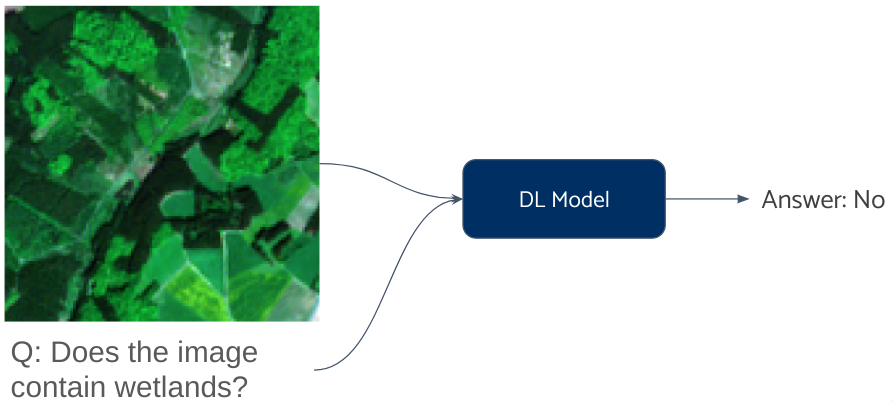
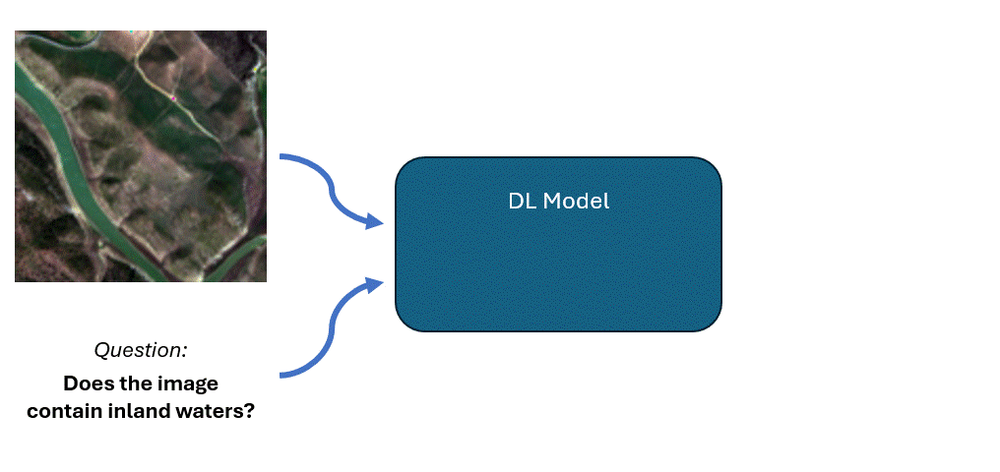
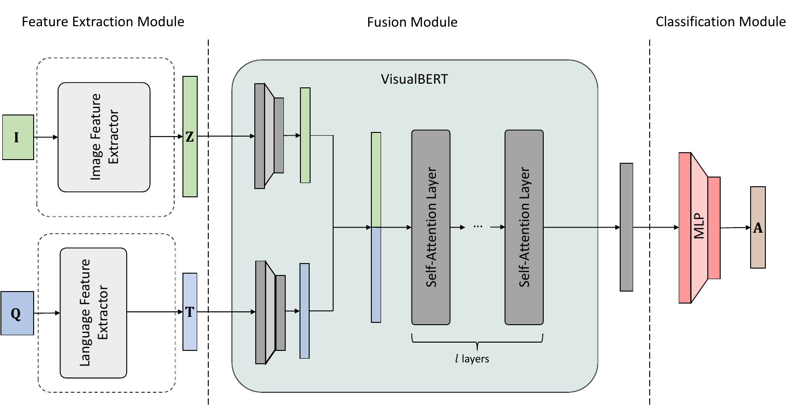
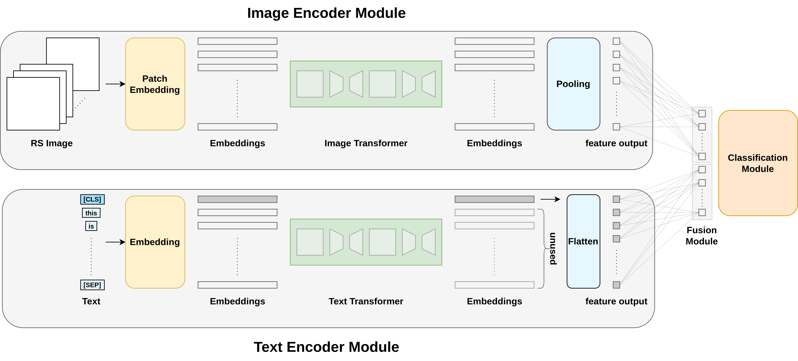
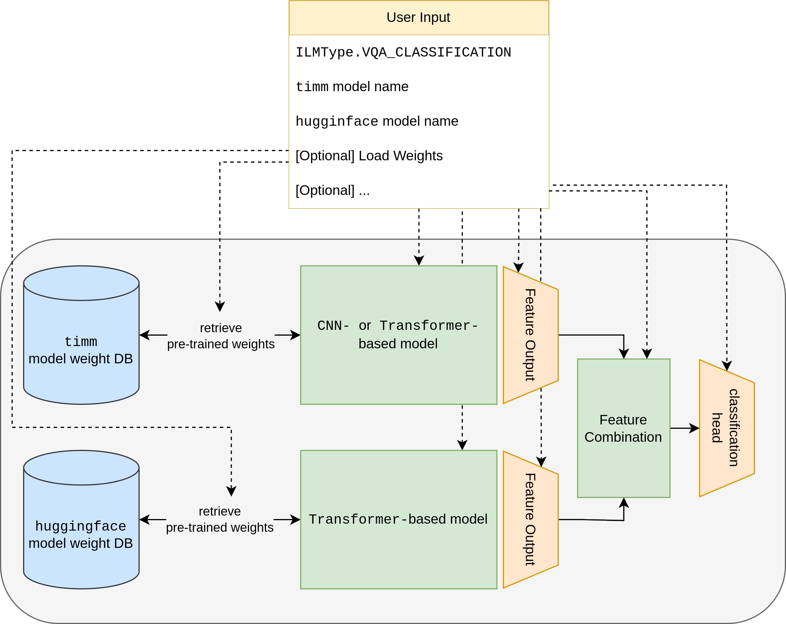
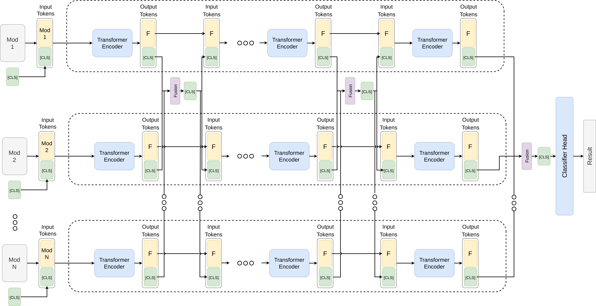
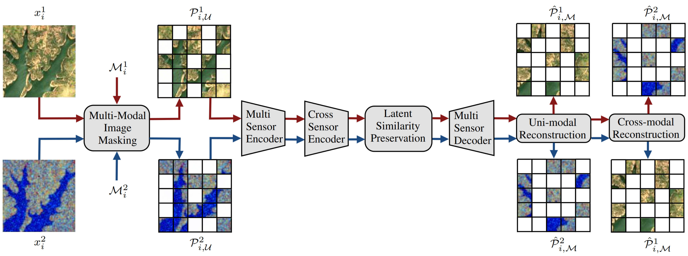

# [Contributions of the TU Berlin to the AI Cube Project](https://eo-lab.org/en/projects/?id=12443968-ab8d-439b-8794-57d25b260406) 

<a href="https://www.tu.berlin/">

<a href="https://rsim.berlin/">

<a href="https://eo-lab.org/de/projects/?id=12443968-ab8d-439b-8794-57d25b260406">

Data cubes offer a natural, analysis-oriented view of spatiotemporal data that also scales very well.
Artificial intelligence (AI), on the other hand, improves the understanding of earth observation (EO) data with new methods.
Interestingly, both techniques are based on the same mathematical foundations, namely tensor algebra.

The AI-Cube project explored how data cubes and AI-based analytics
can be advantageously combined. The project team consisted of a
partnership of [Constructor (formerly Jacobs) University](https://constructor.university/)
(project management), the [Remote Sensing Image Analysis (RSiM) Group of the TU Berlin](https://rsim.berlin/)
and the [rasdaman GmbH](https://www.rasdaman.com/).
This repository summarizes the development of the TU Berlin within the scope of the [AI Cube project](https://eo-lab.org/en/projects/?id=12443968-ab8d-439b-8794-57d25b260406).

The team from the TU Berlin has investigated deep learning (DL)-based visual-question-answer (VQA) systems.
In the task of VQA in remote sensing (RS), the user asks a question to a system in natural language concerning the content of RS images.
The system then answers the question in natural language by _jointly_ processing the text and image modalities.

<!---  --->

### Multi-Modal Fusion Transformer for Visual Question Answering in Remote Sensing

Their first published architecture [VBFusion](https://arxiv.org/abs/2210.04510), was presented at [SPIE Image and Signal Processing for Remote Sensing in 2022](https://spie.org/spie-sensors-imaging/presentation/Multi-modal-fusion-transformer-for-visual-question-answering-in-remote/12267-21#_=_).
It achieved state-of-the-art performance in the largest remote sensing (RS) VQA dataset of the time.
The code to train and evaluate the architecture is publicly available under:
[https://git.tu-berlin.de/rsim/multi-modal-fusion-transformer-for-vqa-in-rs](https://git.tu-berlin.de/rsim/multi-modal-fusion-transformer-for-vqa-in-rs)

Architectural overview of VBFusion

One downside of the introduced VBFusion architecture is the long training time and expensive computing requirements due to the architecture's size and complexity.
As a result, the architecture is unsuitable for operational applications in the RS domain.

### LIT-4-RSVQA: Lightweight Transformer-Based Visual Question Answering in Remote Sensing

To overcome the shortcoming, the next work introduced lightweight transformer-based architectures for VQA in RS [LiT-4-RSVQA](https://arxiv.org/abs/2306.00758).
The paper was presented at the [IEEE International Geoscience and Remote Sensing Symposium (IGARSS) 2023](https://ieeexplore.ieee.org/document/10281674)
with the code publicly available under: [https://git.tu-berlin.de/rsim/lit4rsvqa](https://git.tu-berlin.de/rsim/lit4rsvqa).

Illustration of the LiT-4-RSVQA architecture

Compared to the previous VBFusion architecture, the smallest model of the LiT-4-RSVQA architecture had over 35x fewer parameters, resulting
in significantly fewer parameters and, therefore, lower computational requirements while still improving the overall performance.
For further details, the reader is referred to the [research paper](https://arxiv.org/pdf/2306.00758.pdf).

### ConfigILM: A general purpose configurable library for combining image and language models for visual question answering

To make research in the VQA in the RS field more accessible, the TU Berlin has developed the [ConfigILM](https://github.com/lhackel-tub/ConfigILM) library.
This _open-source_ library provides a convenient implementation for seamlessly combining models
from two of the most popular [`pytorch`](https://pytorch.org/) libraries,
the highly regarded [`timm`](https://github.com/rwightman/pytorch-image-models) and [`huggingface`🤗](https://huggingface.co/) libraries.
With an extensive collection of nearly _1000 image_ and _over 100 language models_,
with an _additional 120,000_ community-uploaded models in the [`huggingface`🤗 model collection](https://huggingface.co/models),
`ConfigILM` offers a diverse range of model combinations that require minimal implementation effort.
Its vast array of models makes it an unparalleled resource for developers seeking to create
innovative and sophisticated _image-language models_ with ease.

Illustration of the ConfigILM architecture

The code and the extensive documentation about its use are available at: [https://github.com/lhackel-tub/ConfigILM](https://github.com/lhackel-tub/ConfigILM).
The library was accepted at the [SoftwareX journal in May 2024](https://www.sciencedirect.com/science/article/pii/S235271102400102X).

### Transformer-based Multi-Modal Learning for Multi Label Remote Sensing Image Classification

As part of the AI-Cube project, the TU Berlin has also investigated different multi-modality applications.
In the work [Transformer-based Multi-Modal Learning for Multi Label Remote Sensing Image Classification](https://arxiv.org/abs/2306.01523), a novel
_Synchronized Class Token Fusion_ (SCT Fusion) architecture is introduced in the framework of multi-modal, multi label classification (MLC) of remote sensing
(RS) images. The proposed architecture leverages modality-specific attention-based transformer encoders to process varying input modalities while exchanging information across
modalities by synchronizing the special class tokens after each transformer encoder block.

Architectural overview of SCT Fusion

Experimental results show the effectiveness of the proposed architecture over single-modality architectures and an early fusion multi-modal
architecture when evaluated on the [BigEarthNet](https://bigearth.net/) MLC dataset.
The code for the proposed architecture is publicly available under: [https://git.tu-berlin.de/rsim/sct-fusion](https://git.tu-berlin.de/rsim/sct-fusion)

### Exploring Masked Autoencoders for Sensor-Agnostic Image Retrieval in Remote Sensing

Apart from multi-modal multi label classification, the TU Berlin has also investigated novel strategies to retrieve
RS images across _different_ image modalities based on their content in a self-supervised manner.
Concretely, by adapting [masked autoencoders (MAEs)](https://arxiv.org/abs/2111.06377).

Overview of the CSMAE architecture

To this end, the [research paper](https://arxiv.org/abs/2401.07782) provides a systematic overview of the possible adaptations of the vanilla MAE to exploit masked image modelling on
multi-sensor RS image archives (denoted as cross-sensor masked autoencoders (CSMAEs)). 
Several different CSMAE models are introduced by applying different adjustments to the vanilla MAE.
The code is available under [https://github.com/jakhac/CSMAE](https://github.com/jakhac/CSMAE)

