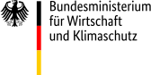
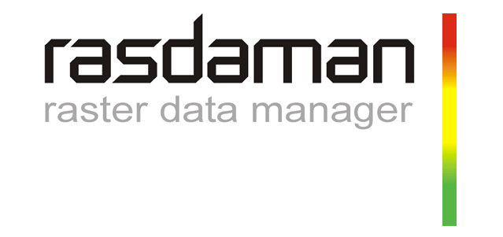

# Added Value from Big Earth Observation Data by Combining AI and Federated Data Cubes

&ensp;

&ensp;

&ensp;
<!-- 

&ensp;

&ensp;

&ensp;

 -->
&ensp;

This repository lists the achievements of the [Remote Sensing Image Analysis (RSiM)](https://rsim.berlin) Group of [TU Berlin](https://tu.berlin) & [BIFOLD](https://bifold.berlin) within [the AI-Cube project](https://ai-cu.be/) funded by the German Federal Ministry of Economic Affairs and Climate Action ([BMWK](https://bmwk.de)) for the period 2021-2023. The project partners were [Remote Sensing Image Analysis (RSiM)](https://rsim.berlin) Group of [TU Berlin](https://tu.berlin) & [BIFOLD](https://bifold.berlin), [Constructor (formerly Jacobs) University](https://constructor.university/) and [rasdaman GmbH](https://www.rasdaman.com/). 

[The AI-Cube project](https://ai-cu.be/) explored how data cubes and AI-based analytics can be advantageously combined. A particular attention was given in the development of a deep learning (DL)-based visual-question-answer (VQA) system, where the user asks a question to a system in natural language concerning the content of RS images. Then, the system answers the question in natural language by jointly processing the text and image modalities.

  

Illustration of a VQA system

## Achievements

The AI-Cube project has produced several research papers and a prototype that have been presented at various international conferences. The following list provides an overview of the achievements of the [Remote Sensing Image Analysis (RSiM)](https://rsim.berlin) Group of [TU Berlin](https://tu.berlin) & [BIFOLD](https://bifold.berlin).

||  Products and Links |
|-------|-------------|
|     | ✅ **ConfigILM**   ➡️ [A General Purpose Configurable Library for Combining Image and Language Models for Visual Question Answering](https://github.com/lhackel-tub/ConfigILM)  |
|     | ✅ **LIT-4-RSVQA Architecture**   ➡️ [Lightweight Transformer-Based Visual Question Answering in Remote Sensing](https://git.tu-berlin.de/rsim/lit4rsvqa)  |
|      | ✅ **VBFusion Architecture**   ➡️ [Multi-Modal Fusion Transformer for Visual Question Answering in Remote Sensing](https://git.tu-berlin.de//multi-modal-fusion-transformer-for-vqa-in-rs) |
|    | ✅ **SCT Fusion Architecture**   ➡️ [ Transformer-based Multi-Modal Learning for Multi Label Remote Sensing Image Classification](https://git.tu-berlin.de/rsim/sct-fusion) |
|         | ✅ **CM-MAE Architecture**   ➡️ [Exploring Masked Autoencoders for Sensor-Agnostic Image Retrieval in Remote Sensing](https://github.com/jakhac/CSMAE) |

## Acknowledgement

The [Remote Sensing Image Analysis (RSiM)](https://rsim.berlin) Group of [TU Berlin](https://tu.berlin) & [BIFOLD](https://bifold.berlin) is thankful to [EO-Lab](https://eo-lab.org/de/) for providing infrastructure to facilitate deep learning model training during this project.