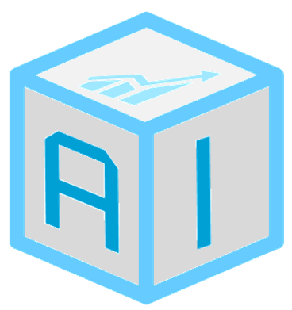

# Added Value from Big Earth Observation Data by Combining AI and Federated Data Cubes

This repository lists the achievements of [the AI-Cube project](https://ai-cu.be/) funded by the German Federal Ministry of Economic Affairs and Climate Action ([BMWK](https://bmwk.de)) for the period 2021-2023. The project partners were [Constructor (formerly Jacobs) University](https://constructor.university/), [rasdaman GmbH](https://www.rasdaman.com/), and Remote Sensing Image Analysis ([RSiM](https://rsim.berlin)) Group of [TU Berlin](https://tu.berlin) & [BIFOLD](https://bifold.berlin). The partners are thankful to [EO-Lab](https://eo-lab.org/de/) for providing infrastructure to facilitate model training for works in this project.

[The AI-Cube project](https://ai-cu.be/) explored how data cubes and AI-based analytics can be advantageously combined. A particular attention was given in the development of a deep learning (DL)-based visual-question-answer (VQA) system, where the user asks a question to a system in natural language concerning the content of RS images. Then, the system answers the question in natural language by jointly processing the text and image modalities.

  

Overview of how a VQA system works

## Achievements

The AI-Cube project has produced several research papers and a prototype that have been presented at various international conferences and journals. The following list provides an overview of the achievements:

| Product | Links |
|-------|-------------|
|   | <i class="fab fa-github"></i> [ConfigILM: A General Purpose Configurable Library for Combining Image and Language Models for Visual Question Answering](https://github.com/lhackel-tub/ConfigILM)  |
|  | <i class="fab fa-gitlab"></i> [LIT-4-RSVQA Architecture: Lightweight Transformer-Based Visual Question Answering in Remote Sensing](https://git.tu-berlin.de/rsim/lit4rsvqa)  |
|  | <i class="fab fa-gitlab"></i> [VBFusion Architecture: Multi-Modal Fusion Transformer for Visual Question Answering in Remote Sensing](https://git.tu-berlin.de//multi-modal-fusion-transformer-for-vqa-in-rs) |
|  | <i class="fab fa-github"></i> [SCT Fusion Architecture: Transformer-based Multi-Modal Learning for Multi Label Remote Sensing Image Classification](https://git.tu-berlin.de/rsim/sct-fusion) |
|  | <i class="fab fa-github"></i> [CM-MAE Architecture: Exploring Masked Autoencoders for Sensor-Agnostic Image Retrieval in Remote Sensing](https://github.com/jakhac/CSMAE) |
|  | [AI-Cube Demo](https://aicube.rasdaman.com/rasdaman-dashboard/) |

